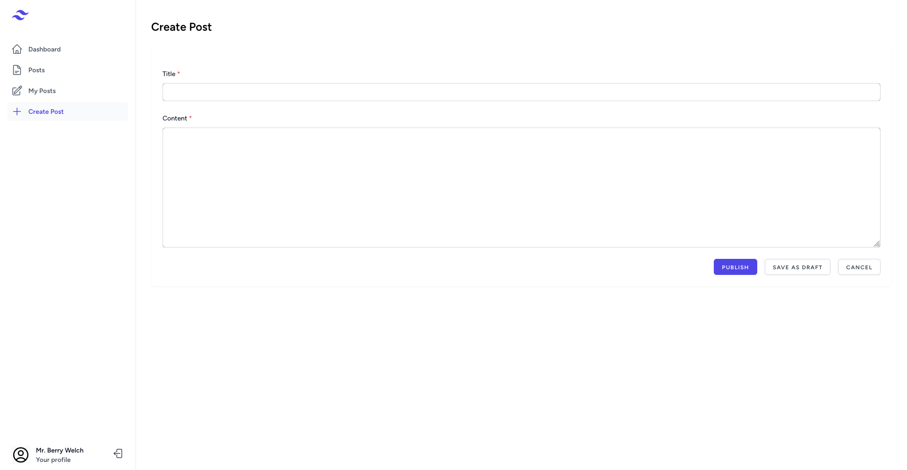
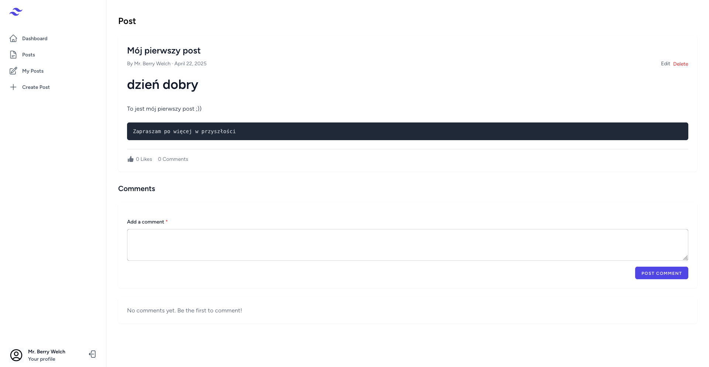
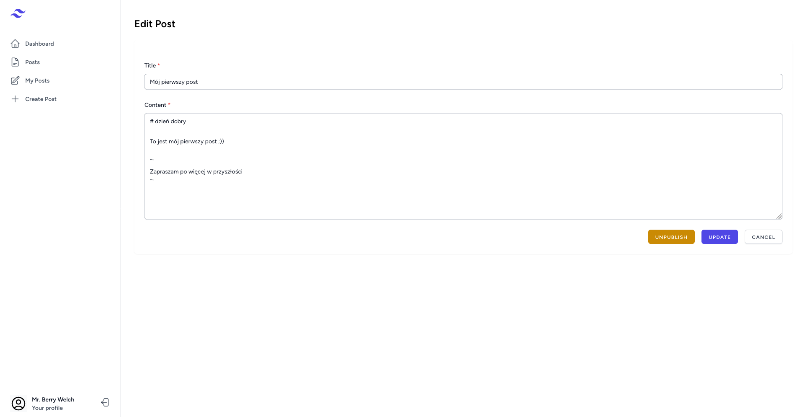
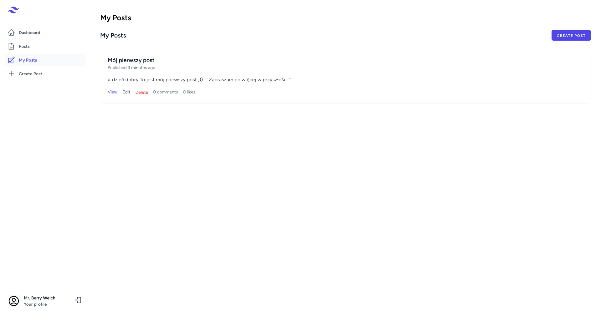
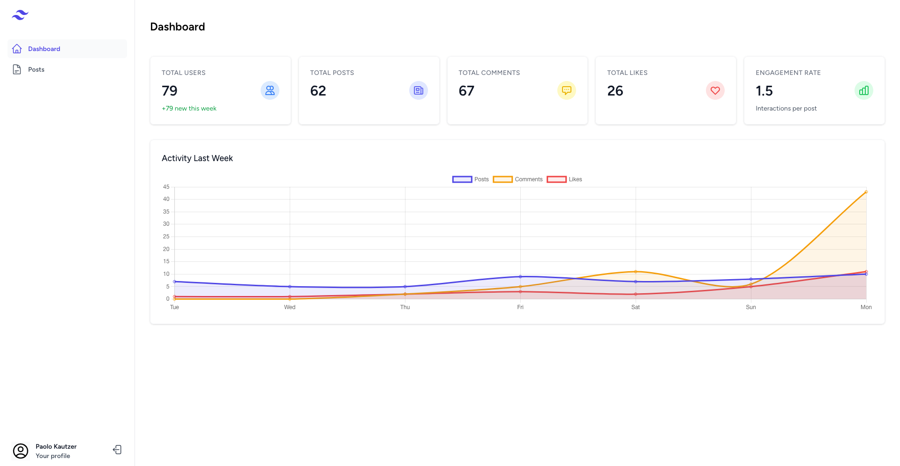
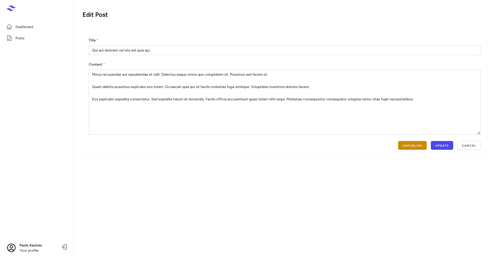
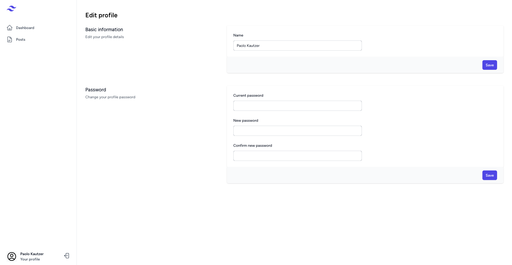

# Dokumentacja Techniczna Projektu Kajetan Kucharski 279474

## Spis treści

1. [Instalacja](project/install.md)
2. [Baza danych](project/database.md)
3. [Bezpieczeństwo](project/security.md)

## Wprowadzenie

Niniejsza dokumentacja zawiera szczegółowe informacje dotyczące systemu.

## Struktura systemu

System składa się z następujących modułów:

- **Moduł Admin** - zarządzanie systemem przez administratorów
- **Moduł Customer** - funkcjonalności dla użytkowników końcowych
- **Moduł Post** - zarządzanie postami i komentarzami

## Funkcjonalności

System oferuje następujące główne funkcjonalności:

### Dla użytkowników (klientów)
- Rejestracja i logowanie
- Przeglądanie postów
- Tworzenie i edycja własnych postów
- Komentowanie postów
- Odpowiadanie na komentarze
- Polubienia postów i komentarzy
- Zarządzanie profilem użytkownika

### Dla administratorów

- Logowanie
- Moderacja postów i komentarzy
- Przeglądanie statystyk systemu
- Zarządzanie profilem administratora

