# Dokumentacja Techniczna Projektu Kajetan Kucharski 279474

## Spis treści

1. [Wprowadzenie](#wprowadzenie)
2. [Struktura systemu](#struktura-systemu)
3. [Funkcjonalności](#funkcjonalności)
4. [Instalacja](#instalacja)
5. [Baza danych](#baza-danych)
6. [Zabezpieczenia i ochrona przed atakami](#zabezpieczenia-i-ochrona-przed-atakami)

# Wprowadzenie

Niniejsza dokumentacja zawiera szczegółowe informacje dotyczące systemu.

# Struktura systemu

System składa się z następujących modułów:

- **Moduł Admin** - zarządzanie systemem przez administratorów
- **Moduł Customer** - funkcjonalności dla użytkowników końcowych
- **Moduł Post** - zarządzanie postami i komentarzami

# Funkcjonalności

System oferuje następujące główne funkcjonalności:

### Dla użytkowników (klientów)
- Rejestracja i logowanie
- Przeglądanie postów
- Tworzenie i edycja własnych postów
- Komentowanie postów
- Odpowiadanie na komentarze
- Polubienia postów i komentarzy
- Zarządzanie profilem użytkownika


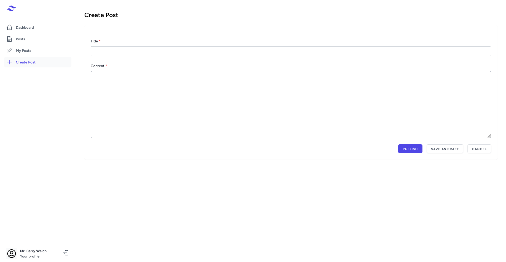

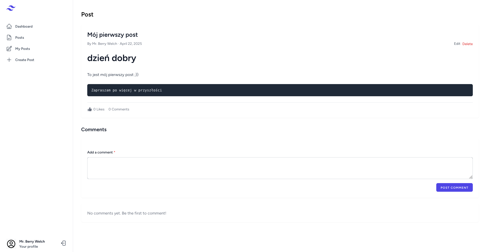

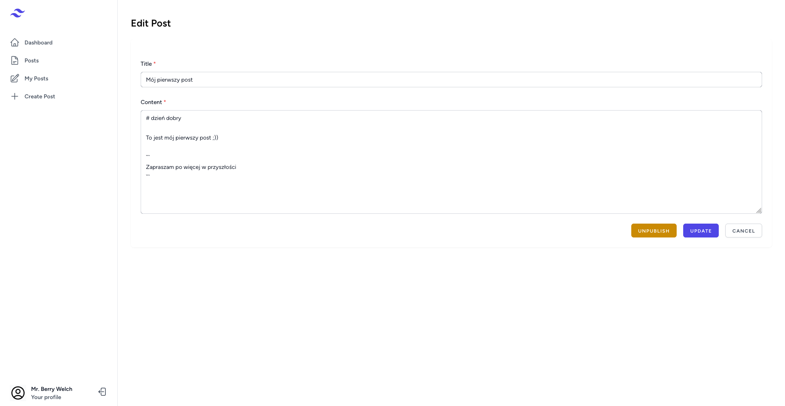

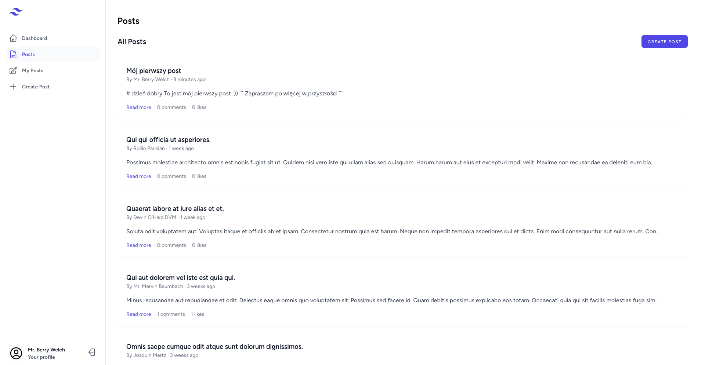

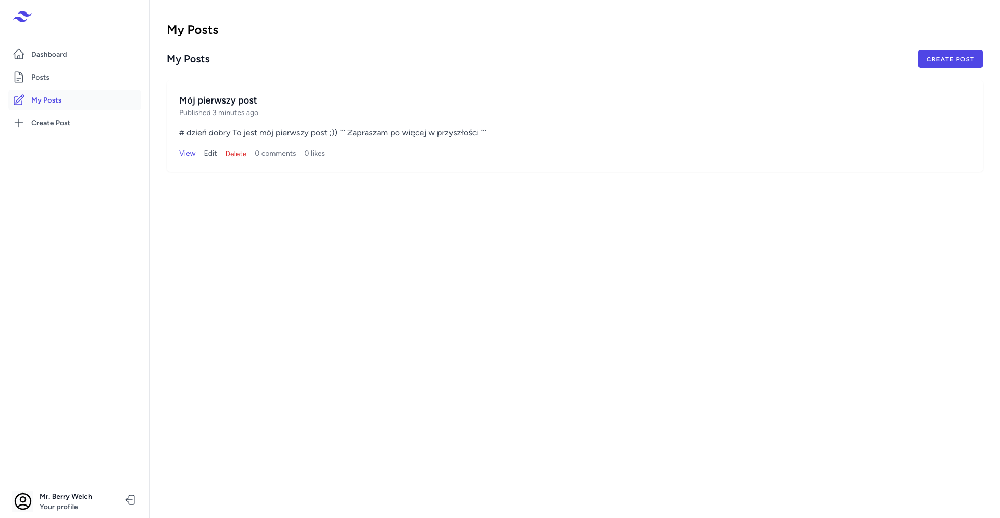

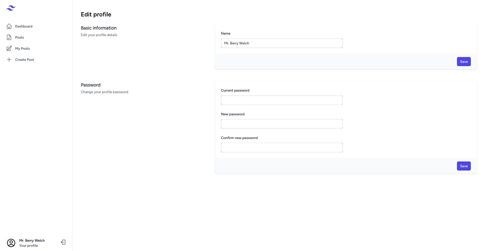

### Dla administratorów

- Logowanie
- Moderacja postów i komentarzy
- Przeglądanie statystyk systemu
- Zarządzanie profilem administratora

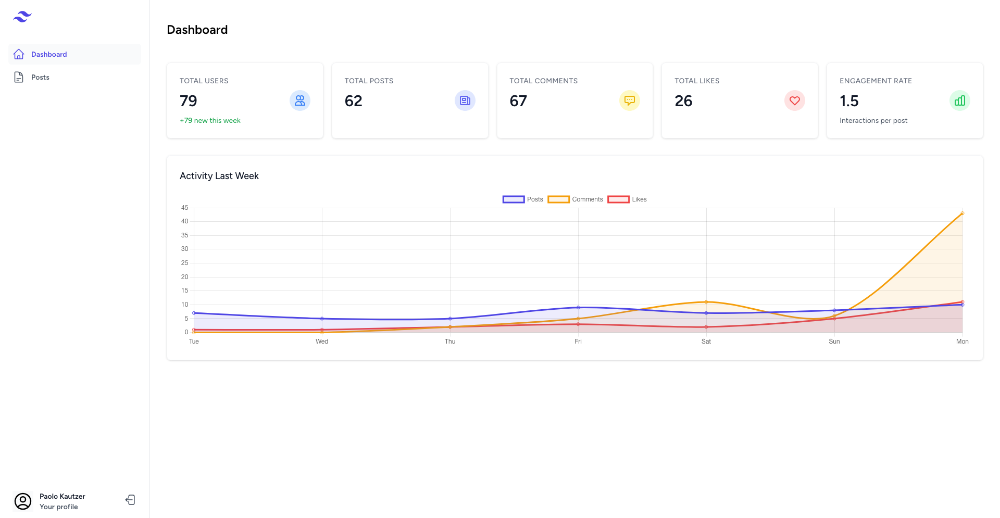

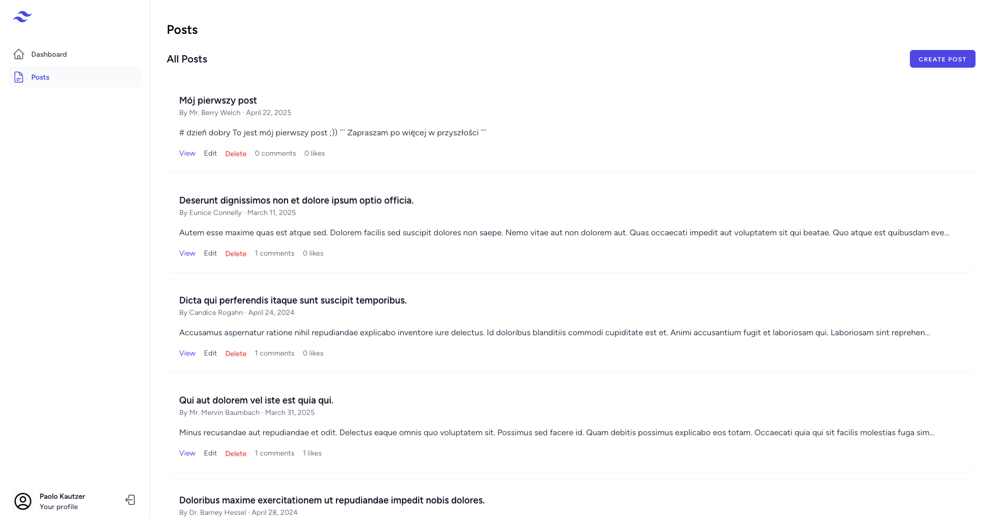

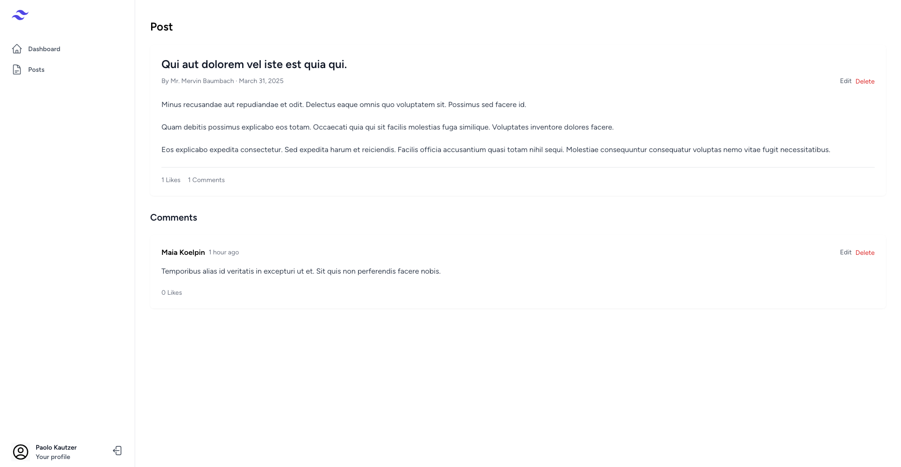

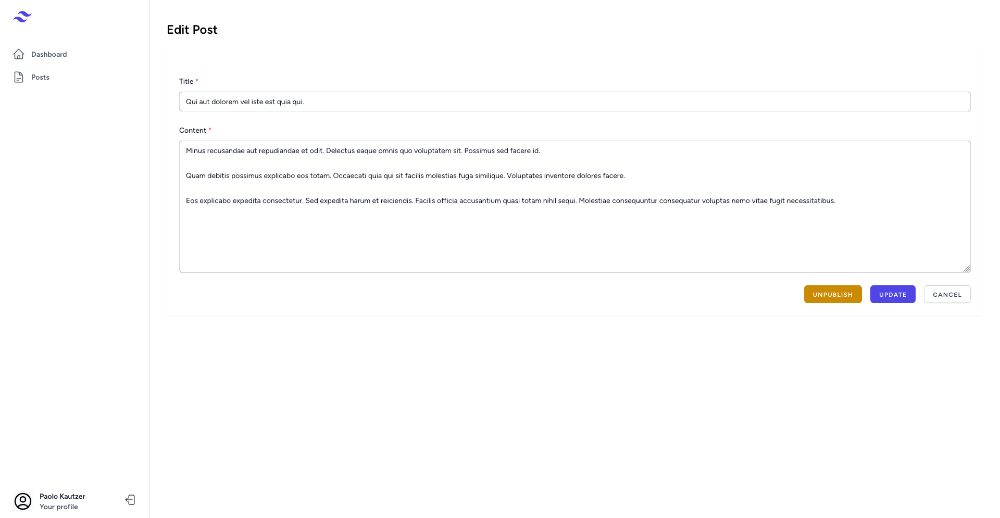

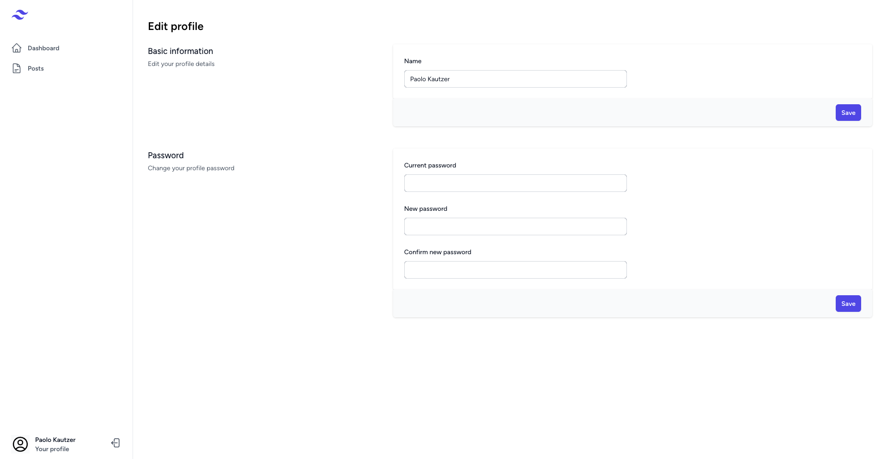

# Instalacja

### Wymagania wstępne

Przed rozpoczęciem instalacji upewnij się, że posiadasz:

- Docker i Docker Compose (zalecane) lub:
  - PHP 8.3
  - PostgreSQL 16
  - Node.js 20
  - Composer
  - npm

### Instalacja z użyciem Dockera (zalecana)

#### Krok 1: Klonowanie repozytorium

```bash
git clone https://github.com/MreeP/BazyDanych-Relacyjne blog
cd blog
```

#### Krok 2: Konfiguracja pliku .env

```bash
cp .env.example .env
```

Edytuj plik `.env` i dostosuj ustawienia bazy danych oraz inne parametry konfiguracyjne.

#### Krok 3: Uruchomienie kontenerów Docker

```bash
composer install --no-dev
```

```bash
./vendor/bin/sail up -d
```

#### Krok 4: Instalacja zależności

```bash
./vendor/bin/sail npm install
```

#### Krok 5: Generowanie klucza aplikacji

```bash
./vendor/bin/sail artisan key:generate
```

#### Krok 6: Migracja bazy danych

```bash
./vendor/bin/sail artisan migrate:fresh
```

Lub w celu załadowania również danych testowych:

```bash
./vendor/bin/sail artisan migrate:fresh --seed
```

#### Krok 7: Kompilacja zasobów front-end

```bash
./vendor/bin/sail npm run build
```

### Weryfikacja instalacji

Po zakończeniu instalacji, aplikacja powinna być dostępna pod adresem:

- http://localhost:8000 - dla użytkowników
- http://localhost:8000/admin - dla administratorów

# Baza danych

### Wprowadzenie

System wykorzystuje bazę danych PostgreSQL 16 do przechowywania wszystkich danych aplikacji. Baza danych zawiera tabele do zarządzania użytkownikami (klientami i administratorami), postami, komentarzami oraz polubieniami, a także tabele systemowe do obsługi kolejek, sesji i pamięci podręcznej.

### Schemat bazy danych

Baza danych składa się z następujących głównych komponentów:

- Tabele użytkowników (admins, customers)
- Tabele zawartości (posts, comments)
- Tabele interakcji (likes)
- Tabele systemowe (sessions, cache, itp.)

### Tabele

#### Użytkownicy

##### Tabela: admins

Przechowuje dane administratorów systemu.

| Kolumna        | Typ          | Opis                                  |
|----------------|--------------|---------------------------------------|
| id             | uuid         | Unikalny identyfikator administratora |
| name           | varchar(255) | Imię i nazwisko administratora        |
| email          | varchar(255) | Adres email (używany do logowania)    |
| password       | varchar(255) | Zahaszowane hasło                     |
| remember_token | varchar(100) | Token do funkcji "zapamiętaj mnie"    |
| created_at     | timestamp    | Data utworzenia konta                 |
| updated_at     | timestamp    | Data ostatniej aktualizacji konta     |

##### Tabela: customers

Przechowuje dane użytkowników końcowych (klientów).

| Kolumna           | Typ          | Opis                               |
|-------------------|--------------|------------------------------------|
| id                | uuid         | Unikalny identyfikator klienta     |
| name              | varchar(255) | Imię i nazwisko klienta            |
| email             | varchar(255) | Adres email (używany do logowania) |
| email_verified_at | timestamp    | Data weryfikacji adresu email      |
| password          | varchar(255) | Zahaszowane hasło                  |
| remember_token    | varchar(100) | Token do funkcji "zapamiętaj mnie" |
| created_at        | timestamp    | Data utworzenia konta              |
| updated_at        | timestamp    | Data ostatniej aktualizacji konta  |

#### Posty i komentarze

##### Tabela: posts

Przechowuje posty utworzone przez użytkowników.

| Kolumna      | Typ          | Opis                              |
|--------------|--------------|-----------------------------------|
| id           | uuid         | Unikalny identyfikator posta      |
| title        | varchar(255) | Tytuł posta                       |
| slug         | varchar(255) | Przyjazny URL posta               |
| content      | text         | Treść posta                       |
| customer_id  | uuid         | Identyfikator autora (klienta)    |
| published_at | timestamp    | Data publikacji posta             |
| created_at   | timestamp    | Data utworzenia posta             |
| updated_at   | timestamp    | Data ostatniej aktualizacji posta |

##### Tabela: comments

Przechowuje komentarze do postów.

| Kolumna     | Typ       | Opis                                                  |
|-------------|-----------|-------------------------------------------------------|
| id          | uuid      | Unikalny identyfikator komentarza                     |
| content     | text      | Treść komentarza                                      |
| customer_id | uuid      | Identyfikator autora komentarza                       |
| post_id     | uuid      | Identyfikator posta, do którego odnosi się komentarz  |
| parent_id   | uuid      | Identyfikator komentarza nadrzędnego (dla odpowiedzi) |
| created_at  | timestamp | Data utworzenia komentarza                            |
| updated_at  | timestamp | Data ostatniej aktualizacji komentarza                |

#### Polubienia

##### Tabela: likes

Przechowuje polubienia postów i komentarzy.

| Kolumna       | Typ          | Opis                                       |
|---------------|--------------|--------------------------------------------|
| id            | uuid         | Unikalny identyfikator polubienia          |
| customer_id   | uuid         | Identyfikator klienta, który polubił       |
| likeable_type | varchar(255) | Typ polubionego obiektu (Post lub Comment) |
| likeable_id   | uuid         | Identyfikator polubionego obiektu          |
| created_at    | timestamp    | Data utworzenia polubienia                 |
| updated_at    | timestamp    | Data ostatniej aktualizacji polubienia     |

#### Systemowe

##### Tabela: sessions

Przechowuje sesje użytkowników.

| Kolumna       | Typ          | Opis                                  |
|---------------|--------------|---------------------------------------|
| id            | varchar(255) | Unikalny identyfikator sesji          |
| user_id       | uuid         | Identyfikator użytkownika             |
| ip_address    | varchar(45)  | Adres IP użytkownika                  |
| user_agent    | text         | Informacje o przeglądarce użytkownika |
| payload       | text         | Dane sesji                            |
| last_activity | integer      | Czas ostatniej aktywności             |

##### Tabela: password_reset_tokens_admin i password_reset_tokens_customer

Przechowują tokeny resetowania haseł.

| Kolumna    | Typ          | Opis                    |
|------------|--------------|-------------------------|
| email      | varchar(255) | Adres email użytkownika |
| token      | varchar(255) | Token resetowania hasła |
| created_at | timestamp    | Data utworzenia tokenu  |

### Relacje

- **customers** -> **posts**: Jeden klient może mieć wiele postów (1:N)
- **customers** -> **comments**: Jeden klient może mieć wiele komentarzy (1:N)
- **posts** -> **comments**: Jeden post może mieć wiele komentarzy (1:N)
- **comments** -> **comments**: Komentarz może mieć wiele odpowiedzi (1:N, self-referencing)
- **customers** -> **likes**: Jeden klient może mieć wiele polubień (1:N)
- **posts/comments** -> **likes**: Post lub komentarz może mieć wiele polubień (polimorficzna relacja 1:N)

### Indeksy

Baza danych wykorzystuje następujące indeksy dla optymalnej wydajności:

- Indeksy podstawowe (primary key) na kolumnach id we wszystkich tabelach
- Indeksy unikalne na kolumnach email w tabelach admins i customers
- Indeksy na kluczach obcych (customer_id, post_id, parent_id)
- Indeksy na kolumnach slug w tabeli posts dla szybkiego wyszukiwania po URL
- Indeksy na polimorficznych relacjach (likeable_type, likeable_id) w tabeli likes

# Zabezpieczenia i ochrona przed atakami

### Wprowadzenie

Niniejszy dokument opisuje środki bezpieczeństwa zaimplementowane w systemie w celu ochrony przed różnymi rodzajami ataków.

### Uwierzytelnianie i autoryzacja

#### Silne mechanizmy uwierzytelniania

- **Haszowanie haseł**: Wszystkie hasła są haszowane przy użyciu algorytmu Bcrypt z odpowiednim czynnikiem pracy (cost factor).
- **Weryfikacja adresu email**: Wymagana jest weryfikacja adresu email przed uzyskaniem pełnego dostępu do konta.
- **Limity prób logowania**: Zaimplementowano mechanizm ograniczający liczbę nieudanych prób logowania (rate limiting).
- **Tokeny CSRF**: Każdy formularz zawiera token CSRF, aby zapobiec atakom Cross-Site Request Forgery.

#### Kontrola dostępu

- **Polityki dostępu**: Zdefiniowano szczegółowe polityki dostępu dla różnych typów użytkowników (klienci, administratorzy).
- **Izolacja interfejsów**: Interfejsy administratora i klienta są całkowicie oddzielone.

### Ochrona przed popularnymi atakami

#### Cross-Site Scripting (XSS)

- **Automatyczne escapowanie**: Wszystkie dane wyjściowe są automatycznie escapowane w szablonach Blade.
- **Sanityzacja danych wejściowych**: Wszystkie dane wejściowe są sanityzowane przed zapisem do bazy danych.

#### SQL Injection

- **Prepared Statements**: Wszystkie zapytania do bazy danych wykorzystują prepared statements.
- **ORM Eloquent**: Wykorzystanie ORM Eloquent zapewnia dodatkową warstwę ochrony przed SQL Injection.
- **Parametryzowane zapytania**: Wszystkie zapytania są parametryzowane, a nie budowane przez konkatenację stringów.

#### Cross-Site Request Forgery (CSRF)

- **Tokeny CSRF**: Każdy formularz zawiera unikalny token CSRF.
- **Weryfikacja tokenu**: Każde żądanie POST, PUT, DELETE jest weryfikowane pod kątem poprawności tokenu CSRF.
- **Same-Site Cookies**: Pliki cookie są oznaczone jako SameSite=Lax, aby ograniczyć przesyłanie ich w żądaniach cross-site.

#### Ataki typu Brute Force

- **Rate Limiting**: Zaimplementowano ograniczenia liczby żądań dla krytycznych endpointów.

### Bezpieczeństwo bazy danych

#### Ochrona danych

- **Szyfrowanie wrażliwych danych**: Wrażliwe dane są szyfrowane przed zapisem do bazy danych.
- **UUID zamiast inkrementalnych ID**: Wykorzystanie UUID zamiast inkrementalnych identyfikatorów utrudnia zgadywanie ID zasobów.

#### Bezpieczeństwo zapytań

- **Indeksy**: Odpowiednie indeksy zapobiegają atakom DoS poprzez zapytania obciążające bazę danych.
- **Query Logging**: Logowanie nietypowych zapytań do celów audytowych.

### Bezpieczeństwo infrastruktury

#### Bezpieczeństwo kontenerów

- **Izolacja kontenerów**: Każdy kontener ma ograniczone zasoby i uprawnienia.
- **Aktualne obrazy**: Aktualne obrazy Docker używane w celu eliminacji znanych podatności.

### Audyt i monitorowanie

#### Logowanie zdarzeń

- **Strukturyzowane logi**: Logi są zapisywane w formacie strukturyzowanym, co ułatwia ich analizę.
